# SourcePilot system architecture

SourcePilot is an emergency and everyday procurement agent for owner-operated businesses that do not have a procurement team. Models interpret unstructured information and hold natural conversations; deterministic code controls eligibility, money, contact permission, negotiation bounds, and purchasing.

## End-to-end flow

```mermaid
flowchart LR
  Owner[Business owner] -->|voice, text, form, email or SMS| Intake[Intake normalisation]
  Intake --> Review[Owner reviews structured request]
  Review --> Request[(Procurement request + policy snapshot)]

  Request --> Search[OpenAI web search]
  Search --> Scrape[SSRF-guarded public-page retrieval]
  Scrape --> Evidence[(Attributed supplier evidence)]
  Evidence --> Embed[text-embedding-3-small product similarity]
  Embed --> Gates{Deterministic eligibility gates}
  Gates -->|blocked| Human[Owner review / correction]
  Gates -->|eligible| Rank[Profile-weighted candidate ranking]
  Rank --> Authorise[Owner verifies and authorises supplier]

  Authorise --> Queue[(Durable sequential call queue)]
  Queue --> Contact{Pre-call trust policy}
  Contact -->|blocked| Audit[(Agent decision audit)]
  Contact -->|allowed| Voice[ElevenLabs outbound conversation]
  Voice --> Webhook[HMAC-verified transcript webhook]
  Webhook --> Extract[LLM quote extraction from supplier speech only]
  Extract --> Reconcile[Deterministic cents reconciliation]
  Reconcile --> Quotes[(Comparable supplier quotes)]
  Quotes --> OfferRank[Qualifying-offer ranking]
  OfferRank --> Approval{Owner approval or scoped pre-authorisation}
  Approval -->|rules fail| Human
  Approval -->|all rules pass| PO[Audited purchase-order dispatch]
  PO --> Notify[Owner completion call]
  Notify -->|unanswered / voicemail| Fallback[SMS + AgentMail fallback]

  Request --> DB[(Supabase Postgres)]
  Evidence --> DB
  Queue --> DB
  Audit --> DB
  Quotes --> DB
  PO --> DB
```

## Runtime boundaries

| Boundary | Model or provider | Deterministic controls |
| --- | --- | --- |
| Request intake | `gpt-5.6-luna` by default for structured extraction; local parser for the credential-free demo | Required fields, evidence spans, data types, owner confirmation |
| Supplier discovery | `gpt-5.6-terra` web search by default; `text-embedding-3-small` for catalogue-language similarity | Public-URL and SSRF checks, bounded retrieval, evidence persistence, eligibility gates, profile weights |
| Supplier conversation | ElevenLabs Conversational AI | ABR freshness, authorisation, opt-out, local calling hours, attempt cap, identity, callback number, immutable policy snapshot |
| Quote processing | `gpt-5.6-luna` by default, reading supplier speech only | Integer-cents reconciliation, completeness flags, qualification checks, ranking |
| Communications | ElevenLabs, Resend, Twilio and AgentMail | Idempotent outbox records, provider-result auditing, fallback rules |
| Purchase | No model is allowed to authorise a purchase | Atomic server-side recheck of every supplier, product, quantity, delivery, money and authority rule |

Model names are environment-configurable so they can be evaluated and upgraded without changing the control plane. No model score can override a failed hard gate.

## Supplier discovery and selection

### Candidate generation

The discovery Edge Function searches for real Australian suppliers near the requested delivery location. It prefers official supplier pages and local SMEs, accepts at most eight candidates, retrieves at most three public evidence sources per candidate, strips active markup, rejects private/local network targets, and stores a bounded evidence excerpt with its source hash.

Embeddings compare the request query with each evidence excerpt. They improve recall across differing catalogue language; they do not verify ABNs, availability, prices, certifications, or delivery promises.

### Hard gates

A candidate is ineligible for outreach when any of these checks fails:

- ABN is not confirmed active with evidence no older than 24 hours.
- The owner has not authorised the supplier.
- The supplier has opted out.
- A required certification is missing.
- Semantic product match is below 60%.

Low extraction confidence and missing evidence are explicit human-review reasons. They are never silently converted into positive facts.

### Weighted ranking

Eligible candidates are ordered before ineligible candidates. Within each group, the score is the weighted average below; supplier name is the stable final tie-breaker.

| Factor | Hospitality | Construction | General wholesale |
| --- | ---: | ---: | ---: |
| Product match | 25% | 30% | 25% |
| Delivery fit | 25% | 25% | 15% |
| Landed cost | 15% | 15% | 20% |
| Reliability | 15% | 15% | 15% |
| Local proximity | 10% | 5% | 10% |
| Payment terms | 5% | 5% | 10% |
| Certifications | 5% | 5% | 5% |

The live discovery path currently has reliable evidence for product similarity, extraction confidence, locality text, and certifications. Price and payment facts are deliberately left for supplier outreach instead of being invented from web pages.

### Distance status

The current locality score is a text-based match between delivery-location tokens and the supplier locality. It is not a kilometre calculation, and the UI must not present it as one. A production proximity feature needs geocoded coordinates, the coordinate source and timestamp, a straight-line or route distance, and an explicit maximum-radius rule. The map should explain selection; it must not replace the hard gates.

## Negotiation and communication bounds

Each request stores a policy snapshot containing maximum delivered total, minimum payment days, maximum deposit, maximum counteroffers, substitution permission, anonymous market-anchor permission, and purchase mode.

| Situation | Required action |
| --- | --- |
| Supplier asks to stop | Stop immediately; never counter |
| Total, payment term, or deposit is outside policy | Counter only while the counteroffer budget remains |
| Substitution is not authorised | Escalate to the owner |
| Fees or final terms are unconfirmed | Counter or escalate; never treat as agreed |
| Counteroffer limit is reached | Escalate |
| Every rule passes and request requires confirmation | Present to owner; do not accept on the call |
| Every rule passes with stored request-scoped pre-authorisation | Server may issue one PO after a fresh atomic recheck; never initiate payment |

The deterministic decision engine exposes an anonymous market-anchor permission only when `allowAnonymousMarketAnchor` is enabled. The current live ElevenLabs prompt does not receive that flag or a verified competing price, so the deployed call path does **not** quote a competitor today. Adding that capability safely requires a stored, attributable quote; a freshness rule; explicit request-level permission; and a prompt/tool input that never exposes the supplier's identity. The agent must never name another supplier or invent a quote.

The call opens with the requested product, quantity, buyer business, source of the supplier details, AI disclosure, verification callback, opt-out, and an offer to email the brief. It asks whether the time is convenient, targets a first call under two minutes, avoids scripted persuasion, reads back the final quote, and states that no order has been placed. Frustration, uncertainty, unusual terms, substitutions, and missing facts go to a human.

Pre-call code blocks contact unless all of these pass:

- live ABR evidence and legal-name/contact confirmation;
- owner authorisation and no opt-out;
- 9 am–5 pm in the supplier's configured local time;
- fewer than two attempts in the previous 24 hours;
- a valid Australian supplier number, stable callback number, and buyer identity.

## Data and security controls

- Every procurement record is scoped by `organization_id`; membership-based row-level security prevents cross-organisation reads.
- Provider secrets are server-side Supabase secrets. Only the Supabase URL, publishable key, and optional public voice-agent ID belong in `VITE_` variables.
- Supplier-page retrieval rejects private/local addresses, redirect chains, unsupported content types, and oversized responses.
- ElevenLabs post-call events require a fresh valid HMAC signature and a registered conversation ID.
- Quote evidence comes only from supplier turns. Agent questions, targets, budgets, and unconfirmed read-backs are excluded.
- Financial values use integer cents or basis points and are recalculated in application code.
- Queue claims, retries, purchase-order reservation, and communication events are durable and auditable.

## Minimal-credit live verification

Run deterministic tests first. They spend no provider credits and should remain the primary regression suite.

1. Build and run the unit suite, including hard gates, ranking, contact policy, negotiation, HMAC, SSRF, and quote reconciliation.
2. Run the Chrome DevTools Protocol dashboard audit and require zero console errors, page errors, failed requests, and HTTP errors.
3. With local credentials configured, run one discovery query capped at eight candidates and retain its evidence records for the demo.
4. Verify one candidate's ABN once and authorise it manually.
5. Send one written brief to a controlled test inbox.
6. Place one short call only to a team-controlled, consenting Australian test number. Use one supplier, no retry, and the smallest complete script that exercises quote capture.
7. Replay the signed test webhook locally for subsequent quote/ranking regressions instead of placing more calls.
8. Test approval and PO generation against a controlled inbox/number; never use a real supplier or live purchase authority during rehearsal.

Do not run a live call until the team has identified the consenting target number, the permitted time window, and a hard test budget. API keys belong only in ignored `.env.local` files and Supabase secrets; they must never appear in commits, screenshots, logs, or PR descriptions.

## Failure behavior

- Missing credentials disable or clearly fail the connected flow without silently substituting demo evidence.
- Unavailable discovery, ABR, voice, email, or SMS providers leave a reviewable error and audit record.
- Failed call initiation releases the queue item for a bounded retry; the per-supplier contact limit still applies.
- An incomplete or unreconciled quote is stored as `needs_review` and cannot qualify for automatic purchase.
- An unanswered owner completion call triggers SMS and AgentMail fallback; it does not imply supplier acceptance.
